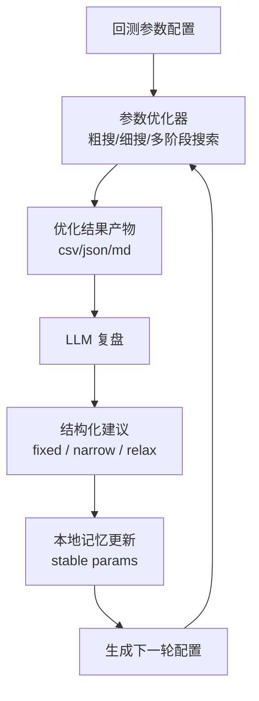

# 参数优化与 LLM 记忆闭环流程

## 1. 目标

这套流程的目标是：

- 先用程序化回测优化器批量搜索参数组合
- 再用大模型对结果做结构化复盘
- 把多轮复盘中的“稳定参数”沉淀到本地记忆
- 将 LLM 建议和本地记忆一起并入下一轮配置
- 逐轮缩小搜索空间，提升收益率与风险收益比

这是一条“程序搜索为主，LLM 辅助解释和缩圈”的闭环，而不是让大模型直接代替回测引擎。

## 2. 整体闭环



## 3. 主要文件

### 参数优化器

- [optimizer.sample.json](/D:/codex/stock_analysis/optimizer.sample.json)
  - 参数优化示例配置
- [optimize_backtest.py](/D:/codex/stock_analysis/scripts/optimize_backtest.py)
  - 参数优化入口脚本
- [optimizer.py](/D:/codex/stock_analysis/stock_analysis/optimizer.py)
  - 优化主流程
- [optimizer_space.py](/D:/codex/stock_analysis/stock_analysis/optimizer_space.py)
  - 参数采样、网格和多阶段空间生成
- [optimizer_report.py](/D:/codex/stock_analysis/stock_analysis/optimizer_report.py)
  - 结果导出和 Markdown 报告

### LLM 复盘与记忆

- [optimizer_llm.py](/D:/codex/stock_analysis/stock_analysis/optimizer_llm.py)
  - LLM 复盘主逻辑
- [review_optimizer_with_llm.py](/D:/codex/stock_analysis/scripts/review_optimizer_with_llm.py)
  - LLM 复盘入口脚本
- [optimizer_llm_prompt.md](/D:/codex/stock_analysis/optimizer_llm_prompt.md)
  - LLM 提示词模板

### 输出目录

默认优化输出目录通常是：

- [data/optimizer](/D:/codex/stock_analysis/data/optimizer)

常见产物包括：

- `backtest_trials.csv`
- `best_params.json`
- `importance.json`
- `optimizer_report.md`
- `next_round_config.json`
- `optimizer_llm_review.json`
- `optimizer_llm_review.md`
- `optimizer_llm_memory.json`
- `optimizer_llm_memory.md`
- `optimizer_llm_next_round_config.json`

## 4. 第一步：运行参数优化器

### 作用

先由程序化优化器跑一轮参数搜索，得到最优组合、重要性统计和下一轮基础配置。

### 推荐命令

```powershell
python D:\codex\stock_analysis\scripts\optimize_backtest.py D:\codex\stock_analysis\optimizer.sample.json
```

### 输入

- 基础回测配置
- 参数范围
- 搜索方法
- 约束条件
- 优化目标

### 输出

- 回测明细结果
- 最优参数组合
- 参数重要性统计
- 自动生成的下一轮配置

## 5. 第二步：运行 LLM 复盘

### 作用

让大模型基于本轮优化结果做结构化分析，不直接替代回测，而是做：

- 结果解释
- 风险提示
- 参数固定建议
- 参数缩圈建议
- 下一轮搜索重点建议

### 推荐命令

```powershell
python D:\codex\stock_analysis\scripts\review_optimizer_with_llm.py D:\codex\stock_analysis\data\optimizer --top-n 5
```

### 读取内容

- `best_params.json`
- `importance.json`
- `next_round_config.json`
- `optimizer_report.md`
- 本地记忆 `optimizer_llm_memory.json`

### 输出内容

- `optimizer_llm_review.json`
- `optimizer_llm_review.md`
- `optimizer_llm_next_round_config.json`

## 6. 第三步：本地记忆如何工作

### 记忆文件

- [optimizer_llm_memory.json](/D:/codex/stock_analysis/data/optimizer/optimizer_llm_memory.json)
- [optimizer_llm_memory.md](/D:/codex/stock_analysis/data/optimizer/optimizer_llm_memory.md)

### 记忆内容

每次 LLM 复盘后，系统会记录：

- 本轮总结
- 最优 trial / run
- 固定参数
- 收窄参数
- 放宽参数
- 重要参数

### 稳定参数识别逻辑

系统会从多轮历史条目中统计：

- `fixed_count`
- `narrow_count`
- `important_count`

并计算：

- `stability_score`
- `recommended_action`
- `consensus_fixed_value`

### 当前稳定参数行为

稳定参数不再只是备注，而是真正参与两层逻辑：

1. 提示词权重
- LLM 会被明确要求优先保留稳定参数
- 如果要改稳定参数，必须给出反证理由

2. 下一轮配置合并
- 如果当前 review 没主动调整某个稳定参数
- 系统会自动施加记忆偏置
- `fix` 型稳定参数会自动固定
- `narrow` 型稳定参数会自动收紧搜索范围

## 7. 第四步：如何生成下一轮配置

下一轮配置来源于三层叠加：

1. 优化器自动生成的基础 `next_round_config.json`
2. LLM review 的建议
   - `fixed_params`
   - `narrow_params`
   - `relax_params`
3. 本地记忆中的稳定参数偏置

最终输出：

- [optimizer_llm_next_round_config.json](/D:/codex/stock_analysis/data/optimizer/optimizer_llm_next_round_config.json)

这个文件可以直接作为下一轮优化器输入。

## 8. 第五步：复用已有 review 更新记忆和配置

如果不想再次请求大模型，可以直接复用已有 review：

```powershell
python D:\codex\stock_analysis\scripts\review_optimizer_with_llm.py D:\codex\stock_analysis\data\optimizer --reuse-review
```

这个模式会：

- 读取已有 `optimizer_llm_review.json`
- 重新应用到下一轮配置
- 更新本地记忆

适合在你修改记忆逻辑、稳定参数逻辑后重新生成配置。

## 9. 第六步：继续下一轮优化

使用合并后的下一轮配置继续跑：

```powershell
python D:\codex\stock_analysis\scripts\optimize_backtest.py D:\codex\stock_analysis\data\optimizer\optimizer_llm_next_round_config.json
```

这样就形成了真正的闭环：

- 优化器搜索
- LLM 复盘
- 本地记忆积累
- 下一轮配置缩圈
- 再优化

## 10. 推荐使用节奏

### 第一轮

- 参数范围稍大
- 先粗搜
- 看收益、回撤、交易数

### 第二轮

- 接入 LLM 建议
- 开始缩圈
- 观察稳定参数是否出现

### 第三轮及以后

- 稳定参数逐渐形成
- 优先固定强共识参数
- 把搜索资源集中在不稳定参数

## 11. 当前设计原则

### 1. 程序优先

所有收益、回撤、交易数都来自真实回测，不让 LLM 替代计算。

### 2. LLM 做研究助手

LLM 负责：

- 解释结果
- 提供微调建议
- 识别稳定参数
- 帮助缩小搜索空间

### 3. 本地记忆持续积累

历史复盘不会丢失，会逐步形成：

- 稳定参数
- 共识固定值
- 更可靠的下一轮缩圈建议

## 12. 当前可以直接使用的命令

### 跑一轮优化

```powershell
python D:\codex\stock_analysis\scripts\optimize_backtest.py D:\codex\stock_analysis\optimizer.sample.json
```

### 跑一轮 LLM 复盘

```powershell
python D:\codex\stock_analysis\scripts\review_optimizer_with_llm.py D:\codex\stock_analysis\data\optimizer --top-n 5
```

### 复用已有 review

```powershell
python D:\codex\stock_analysis\scripts\review_optimizer_with_llm.py D:\codex\stock_analysis\data\optimizer --reuse-review
```

### 用 LLM 合并后的配置继续优化

```powershell
python D:\codex\stock_analysis\scripts\optimize_backtest.py D:\codex\stock_analysis\data\optimizer\optimizer_llm_next_round_config.json
```

## 13. 后续可继续增强的方向

- 稳定参数达到连续多轮后，自动从搜索空间移除
- 让 LLM 直接生成“第二轮配置解释报告”
- 多轮优化完成后，生成策略演化时间线
- 把稳定参数和不稳定参数分别做可视化

## 14. 稳定参数判定规则明细

这一节专门说明本地记忆里 `stable_params` 是怎么计算出来的。

### 14.1 数据来源

每次 LLM 复盘完成后，系统会把这轮结果写入一条历史 entry。

每条 entry 里目前会记录：

- `fixed_param_names`
- `fixed_param_values`
- `narrow_param_names`
- `relax_param_names`
- `important_params`

其中：

- `fixed_param_names`
  - 来自 LLM 输出的 `fixed_params[].name`
- `fixed_param_values`
  - 来自 LLM 输出的 `fixed_params[].value`
  - 用于统计某个参数是否反复被固定到同一个值
- `narrow_param_names`
  - 来自 LLM 输出的 `narrow_params[].name`
- `important_params`
  - 来自优化器重要性统计中排名靠前的参数

### 14.2 三个核心计数

对于每个参数，系统会在多轮 entry 里累计三个计数：

#### `fixed_count`

表示这个参数在历史复盘中，被 LLM 明确建议“固定”的次数。

统计规则：

- 每一轮中，如果该参数出现在 `fixed_params` 里
- 则该轮为它的 `fixed_count + 1`

这个计数代表：

- LLM 对这个参数的“确定性”有多高
- 越高说明越倾向于不再搜索它

#### `narrow_count`

表示这个参数在历史复盘中，被 LLM 建议“收窄搜索范围”的次数。

统计规则：

- 每一轮中，如果该参数出现在 `narrow_params` 里
- 则该轮为它的 `narrow_count + 1`

这个计数代表：

- 这个参数虽然未必应该彻底固定
- 但其有效区间在多轮中持续收缩

#### `important_count`

表示这个参数在历史优化中，多次出现在“重要参数”列表里的次数。

统计规则：

- 每一轮中，如果该参数进入该轮 `important_params`
- 则该轮为它的 `important_count + 1`

这个计数代表：

- 该参数对收益、回撤或目标函数确实有较强影响
- 它不是无关参数

### 14.3 固定值共识统计

如果某个参数进入了 `fixed_params`，系统还会记录它的具体固定值：

- `fixed_param_values[name] = value`

随后会统计：

- 这个参数被固定过哪些值
- 每个值分别出现了几次

这一步的作用是得到：

- `consensus_fixed_value`

即：

- 在历史固定建议中，出现次数最多的固定值

这个值用于判断：

- 该参数是否已经形成“固定值共识”

### 14.4 稳定分 `stability_score`

系统当前使用下面的加权公式：

```text
stability_score = fixed_count * 2 + narrow_count * 1.5 + important_count * 1
```

含义是：

- `fixed_count` 权重最高
  - 因为“建议固定”比“建议收窄”更强
- `narrow_count` 次之
  - 因为它体现了有效区间持续收缩
- `important_count` 最低
  - 因为“重要”不一定等于“稳定”

### 14.5 进入稳定参数的最低门槛

当前规则是：

```text
stability_score >= 2
```

满足这个条件，参数就会被写入 `stable_params`。

这意味着下面几类情况都可能进入：

- `fixed_count = 1`
  - 分数 `2.0`
- `narrow_count = 2`
  - 分数 `3.0`
- `important_count = 2`
  - 分数 `2.0`
- 多种计数组合叠加

所以“稳定参数”并不一定意味着“已经完全锁定”，而是表示：

- 它已经在历史中出现了稳定信号

### 14.6 推荐动作 `recommended_action`

每个稳定参数都会进一步给出一个推荐动作。

当前有三种：

#### `keep`

表示：

- 这个参数已有一定稳定性
- 但还不够强，不建议自动固定或强收缩
- 在提示词里会提高优先级，但在下一轮配置里不强制动作

典型情况：

- 只出现过 1 次固定
- 或只被判定为重要，但还未形成足够共识

#### `narrow`

表示：

- 这个参数已经表现出较明显稳定性
- 适合继续收窄搜索范围

触发条件主要包括：

- `fixed_count >= 2`
- 或 `narrow_count >= 2`

在下一轮配置里，这类参数会被自动进一步收紧区间。

#### `fix`

表示：

- 这个参数已经形成较强共识
- 适合直接固定，不再继续大范围搜索

当前触发条件：

- `fixed_count >= 3`
- 且某个固定值至少重复出现 `2` 次以上

也就是说：

- 不仅多轮建议固定
- 而且固定值本身也趋于一致

这时系统会把：

- `consensus_fixed_value`

作为自动固定值，直接写入下一轮配置。

### 14.7 `consensus_fixed_value` 的作用

如果一个参数被多次固定到相同值，比如：

- 第 1 轮固定到 `4`
- 第 2 轮固定到 `4`
- 第 3 轮固定到 `4`

那么：

- `consensus_fixed_value = 4`

在推荐动作为 `fix` 时：

- 下一轮配置会直接写成单值搜索

例如：

```json
{
  "buy_min_core_hits": {
    "type": "int",
    "values": [4]
  }
}
```

### 14.8 稳定参数如何参与提示词

在发送给 LLM 的提示词中，稳定参数不是简单展示，而是带规则说明：

- 稳定参数优先保留
- 如果要修改稳定参数，必须说明反证依据
- 下一轮搜索空间优先收缩其他不稳定参数

同时还会给出每个稳定参数的：

- `stability_score`
- `recommended_action`
- `fixed_count / narrow_count / important_count`
- `consensus_fixed_value`

这样 LLM 看到的不是一句“这个参数很重要”，而是一组可解释的历史证据。

### 14.9 稳定参数如何参与下一轮配置

在合并 `LLM review -> next_round_config` 时，系统会先看这轮 review 是否已经修改了该参数。

#### 情况 A：这轮 review 已经主动改了它

那么以这轮 review 为准。

#### 情况 B：这轮 review 没有改它

系统会按 `recommended_action` 自动施加偏置：

- `fix`
  - 直接固定为 `consensus_fixed_value`
- `narrow`
  - 自动把现有搜索区间收紧
- `keep`
  - 只在提示词层加权，不自动改配置

### 14.10 为什么要这样设计

这样设计的好处是：

- 不会让单轮 LLM 建议完全覆盖历史经验
- 也不会一刀切把历史稳定参数全部锁死
- 形成“本轮结果 + 历史记忆”的折中机制

简单说：

- 程序负责算结果
- LLM 负责解释结果
- 记忆负责保留跨轮共识

### 14.11 当前注意点

目前稳定参数机制已经可用，但还处在第一版：

- 历史轮数较少时，稳定参数还不会很多
- 前几轮更像“建立记忆”
- 当轮数积累后，稳定参数的作用会越来越明显

后续还可以继续增强：

- 给近期轮次更高权重
- 区分“长期稳定”和“近期稳定”
- 对不同参数类型使用不同稳定分公式
- 达到连续多轮强共识后，自动移出搜索空间

## 15. `optimizer.sample.json` 字段字典

这一节对应当前示例配置文件：

- [optimizer.sample.json](/D:/codex/stock_analysis/optimizer.sample.json)

用于说明优化器配置的每个字段含义、层级关系和常见取值方式。

### 15.1 顶层字段

#### `name`

- 类型：`string`
- 作用：本轮优化任务名称
- 示例：`backtest-optimizer-v2`

#### `workspace`

- 类型：`string`
- 作用：项目工作目录
- 通常指向项目根目录

#### `output_dir`

- 类型：`string`
- 作用：优化结果输出目录
- 会写入：
  - `backtest_trials.csv`
  - `best_params.json`
  - `importance.json`
  - `optimizer_report.md`
  - `next_round_config.json`
  - `optimizer_llm_*`

#### `base_config`

- 类型：`object`
- 作用：所有 trial 共用的回测基础配置

#### `search`

- 类型：`object`
- 作用：定义参数搜索方式、阶段和参数空间

#### `constraints`

- 类型：`object`
- 作用：定义结果过滤条件
- 不满足的方案即使收益高，也会被视为不合格

#### `objective`

- 类型：`object`
- 作用：定义优化排序目标

#### `report`

- 类型：`object`
- 作用：定义哪些结果文件需要输出

### 15.2 `base_config` 字段字典

`base_config` 是实际传入回测引擎的固定参数部分。

#### `base_config.name`

- 类型：`string`
- 作用：单次回测配置名称

#### `base_config.start_date`

- 类型：`string`
- 格式：`YYYY-MM-DD`
- 作用：回测开始日期

#### `base_config.end_date`

- 类型：`string`
- 格式：`YYYY-MM-DD`
- 作用：回测结束日期

#### `base_config.lookback_days`

- 类型：`int`
- 作用：最近交易日数
- 备注：
  - 如果同时给了 `start_date/end_date`
  - 实际通常优先用日期区间

#### `base_config.max_positions`

- 类型：`int`
- 作用：最多持有股票数

#### `base_config.max_single_position`

- 类型：`float`
- 作用：单只股票最大仓位上限
- 示例：`0.30` 表示最多 `30%`

#### `base_config.initial_capital`

- 类型：`float`
- 作用：初始资金

#### `base_config.fee_rate`

- 类型：`float`
- 作用：手续费率
- 示例：`0.001` 表示 `0.1%`

#### `base_config.slippage_rate`

- 类型：`float`
- 作用：滑点率
- 示例：`0.001` 表示 `0.1%`

#### `base_config.market_require_benchmark_above_ma20`

- 类型：`bool`
- 作用：是否要求大盘收盘价站上 `MA20` 才允许开仓

#### `base_config.market_require_benchmark_ma20_up`

- 类型：`bool`
- 作用：是否要求大盘 `MA20` 方向向上

#### `base_config.enabled_buy_rules`

- 类型：`string[]`
- 作用：启用的买入规则列表
- 当前常见值：
  - `buy_strict`
  - `buy_momentum`

#### `base_config.enabled_sell_rules`

- 类型：`string[]`
- 作用：启用的卖出规则列表
- 当前常见值：
  - `sell_trim`
  - `sell_break_ma5`
  - `sell_drawdown`
  - `sell_time_stop`
  - `sell_flip_loss`
  - `sell_market_weak_drop`

### 15.3 `search` 字段字典

#### `search.method`

- 类型：`string`
- 作用：默认搜索方式
- 常见值：
  - `random`
  - `grid`

#### `search.trials`

- 类型：`int`
- 作用：默认总试验次数

#### `search.seed`

- 类型：`int`
- 作用：随机种子，保证结果可复现

#### `search.top_k`

- 类型：`int`
- 作用：保留的前几名结果数量

#### `search.progress_every`

- 类型：`int`
- 作用：每跑多少个 trial 打印一次进度

#### `search.checkpoint_every`

- 类型：`int`
- 作用：每跑多少个 trial 做一次阶段性输出

#### `search.stages`

- 类型：`object[]`
- 作用：多阶段优化配置
- 常见场景：
  - 第一阶段粗搜
  - 第二阶段围绕前几组结果细搜

### 15.4 `search.stages[]` 字段字典

每个 stage 表示一轮独立的搜索阶段。

#### `search.stages[].name`

- 类型：`string`
- 作用：阶段名称
- 示例：
  - `coarse`
  - `refine`

#### `search.stages[].method`

- 类型：`string`
- 作用：该阶段搜索方法
- 常见值：
  - `random`
  - `grid`
  - `refine`

#### `search.stages[].trials`

- 类型：`int`
- 作用：该阶段试验次数

#### `search.stages[].seed`

- 类型：`int`
- 作用：该阶段随机种子

#### `search.stages[].top_k`

- 类型：`int`
- 作用：该阶段保留结果数量

#### `search.stages[].source_top_n`

- 类型：`int`
- 作用：`refine` 阶段从上一阶段前几名结果展开
- 一般只在 `refine` 阶段使用

#### `search.stages[].radius_steps`

- 类型：`int`
- 作用：`refine` 阶段围绕最优值向两边扩几步

#### `search.stages[].relations`

- 类型：`object[]`
- 作用：参数联动约束
- 用于限制不合理参数组合

#### `search.stages[].param_space`

- 类型：`object`
- 作用：当前阶段实际可搜索的参数空间

### 15.5 `relations[]` 字段字典

每条 relation 定义一个参数之间的约束关系。

#### `relations[].left`

- 类型：`string`
- 作用：左侧参数名

#### `relations[].operator`

- 类型：`string`
- 作用：比较运算符
- 常见值：
  - `>=`
  - `>`
  - `<=`
  - `<`
  - `==`

#### `relations[].right`

- 类型：`string`
- 作用：右侧参数名

#### `relations[].message`

- 类型：`string`
- 作用：当约束不满足时的说明文字

### 15.6 `param_space` 字段字典

`param_space` 的 key 是参数名，value 是该参数的搜索规则。

例如：

- `market_score_filter_min_avg`
- `buy_strict_score_total`
- `buy_momentum_score_total`
- `buy_min_core_hits`
- `buy_amount_min`
- `max_single_position`
- `sell_market_score_threshold`
- `sell_market_drop_threshold`

每个参数 spec 常见字段如下。

#### `param_space.<param>.type`

- 类型：`string`
- 作用：参数类型
- 常见值：
  - `int`
  - `float`
  - `bool`

#### `param_space.<param>.min`

- 类型：`int | float`
- 作用：搜索区间下界

#### `param_space.<param>.max`

- 类型：`int | float`
- 作用：搜索区间上界

#### `param_space.<param>.step`

- 类型：`int | float`
- 作用：步长

#### `param_space.<param>.values`

- 类型：`array`
- 作用：离散值列表
- 典型场景：
  - 参数已固定
  - 或只想测试几个明确值

### 15.7 `constraints` 字段字典

#### `constraints.min_trade_count`

- 类型：`int`
- 作用：最少交易次数
- 低于这个值的方案会被视为样本不足

#### `constraints.max_drawdown_lte`

- 类型：`float`
- 作用：最大回撤上限
- 示例：`0.25` 表示最大回撤不能超过 `25%`

#### `constraints.min_win_rate`

- 类型：`float`
- 作用：最低胜率要求
- 示例：`0.25` 表示胜率至少 `25%`

### 15.8 `objective` 字段字典

#### `objective.primary`

- 类型：`string`
- 作用：主排序目标
- 当前常见值：
  - `total_return`

#### `objective.mode`

- 类型：`string`
- 作用：主目标排序方式
- 常见值：
  - `max`
  - `min`

#### `objective.secondary`

- 类型：`object[]`
- 作用：次级排序目标

每条 secondary 包含：

- `field`
  - 指标字段名
- `mode`
  - 排序方式

示例：

- `{"field": "excess_return", "mode": "max"}`
- `{"field": "max_drawdown", "mode": "min"}`

### 15.9 `report` 字段字典

#### `report.save_csv`

- 类型：`bool`
- 作用：是否输出 CSV 明细结果

#### `report.save_json`

- 类型：`bool`
- 作用：是否输出 JSON 结果文件

#### `report.save_md`

- 类型：`bool`
- 作用：是否输出 Markdown 报告

### 15.10 当前 `optimizer.sample.json` 的参数空间摘要

当前示例配置实际搜索的主要参数有：

- `market_score_filter_min_avg`
- `market_score_filter_min_ma5`
- `enable_buy_momentum`
- `enable_sell_time_stop`
- `buy_strict_score_total`
- `buy_momentum_score_total`
- `buy_min_core_hits`
- `buy_amount_min`
- `max_single_position`
- `sell_market_score_threshold`
- `sell_market_drop_threshold`

其中：

- `coarse` 阶段先粗搜
- `refine` 阶段围绕上一阶段前 `3` 名结果继续细搜

### 15.10.1 规则开关字段

优化器现在支持把“规则是否启用”也作为搜索参数，而不是只优化阈值。

当前支持的规则开关字段如下：

- `enable_buy_strict`
  - 映射到：`buy_strict`
- `enable_buy_momentum`
  - 映射到：`buy_momentum`
- `enable_sell_trim`
  - 映射到：`sell_trim`
- `enable_sell_break_ma5`
  - 映射到：`sell_break_ma5`
- `enable_sell_drawdown`
  - 映射到：`sell_drawdown`
- `enable_sell_time_stop`
  - 映射到：`sell_time_stop`
- `enable_sell_flip_loss`
  - 映射到：`sell_flip_loss`
- `enable_sell_market_weak_drop`
  - 映射到：`sell_market_weak_drop`

配置方式示例：

```json
{
  "enable_buy_momentum": { "type": "bool", "values": [true, false] },
  "enable_sell_time_stop": { "type": "bool", "values": [true, false] }
}
```

含义是：

- 优化器会自动比较：
  - 这条规则开启
  - 这条规则关闭
- 再根据收益、回撤、交易数等结果判断哪种更优

说明：

- 这些布尔开关不是直接替代 `enabled_buy_rules / enabled_sell_rules`
- 而是在每个 trial 执行前，自动映射成真实的启用规则列表
- 所以你依然可以保留基础配置里的默认规则集合，再让优化器在 trial 层做开关比较

### 15.11 当前 `optimizer.sample.json` 的联动约束

当前示例中已经定义了一条参数联动：

- `buy_strict_score_total >= buy_momentum_score_total`

含义是：

- 严格买入总分阈值不应低于增强买入总分阈值

这类 relation 很重要，因为它能避免优化器搜索出逻辑上矛盾的参数组合。
