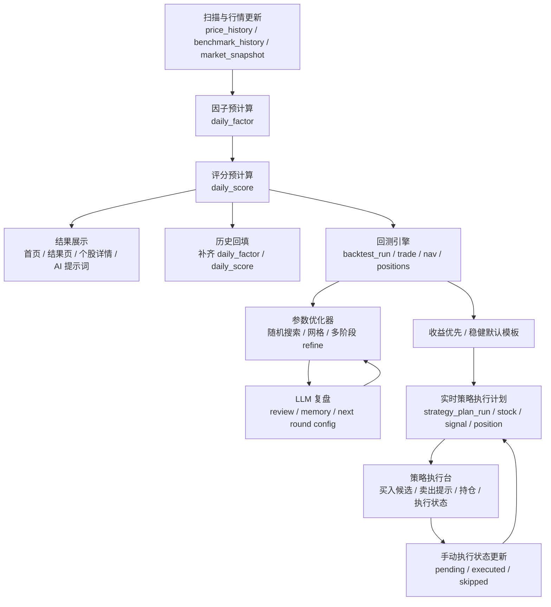

# 当前系统流程说明

本文档用于说明当前 `stock_analysis` 项目已经落地的主流程，包括：

- 扫描与行情更新
- 因子与评分预计算
- 历史回填
- 回测与参数优化
- LLM 复盘与记忆闭环
- 实时策略执行计划

---

## 0. 总体流程图

---

## 1. 系统整体分层

当前系统已经基本形成 6 层结构：

1. 原始行情层
   - 个股历史：`price_history`
   - 大盘历史：`benchmark_history`
   - 当日横截面：`market_snapshot`

2. 预计算因子层
   - 每日因子：`daily_factor`

3. 预计算评分层
   - 每日评分：`daily_score`

4. 回测与研究层
   - `backtest_run / backtest_signal / backtest_trade / backtest_position_daily / backtest_nav`

5. 参数优化与 LLM 复盘层
   - 优化器输出文件
   - LLM review / memory / next round config

6. 实时执行计划层
   - `strategy_plan_run / strategy_plan_stock / strategy_position / strategy_trade_signal / strategy_setting`

---

## 2. 扫描与行情更新流程

主入口在：

- `stock_analysis/service.py`
- `stock_analysis/data_source.py`

当前扫描采用“数据库优先、按缺口补数据”的策略：

1. 先读取数据库缓存
   - 个股：`price_history`
   - 大盘：`benchmark_history`

2. 判断是否命中缓存
   - 如果缓存已经覆盖到目标交易日，并且长度满足窗口要求，则直接复用
   - 否则按增量或完整方式补数据

3. 更新行情表
   - 个股历史写入 `price_history`
   - 大盘历史写入 `benchmark_history`
   - 当日横截面写入 `market_snapshot`

4. 扫描任务记录
   - 任务状态写入 `analysis_task`
   - 批次元信息写入 `analysis_run`

### 当前扫描特点

- 单只股票失败不会拖死整次扫描
- `baostock` 抓取支持重试
- 大盘脏数据会清洗
- 结果展示已不再依赖旧的 `analysis_result`

---

## 3. 因子与评分预计算流程

主入口：

- `stock_analysis/analyzer.py`
- `stock_analysis/service.py`

### 3.1 每日因子

每日因子会写入 `daily_factor`，核心字段包括：

- `MA5 / MA10 / MA20 / MA30 / MA60 / MA120`
- `vol_ma5`
- `ATR14`
- `prior_20_high`
- `CMF(21)`
- `MFI(14)`
- `sector_change`
- `sector_up_ratio`
- `benchmark_close`
- `benchmark_ma20`
- `benchmark_prev_ma20`

### 3.2 每日评分

每日评分写入 `daily_score`，包括：

- `score_total`
- `score_ma_trend`
- `score_volume_pattern`
- `score_capital_sector`
- `score_breakout`
- `score_hold`
- `score_benchmark`
- `signals`
- `summary`
- `score_version`

### 3.3 当前评分结构

总分 100 分，当前权重为：

- 均线多头：18
- 放量上涨 + 缩量回调：15
- 资金流入 + 板块强势：18
- 低位启动突破：22
- 突破后未破位：18
- 大盘共振：10

### 3.4 前台读链

当前前台已统一优先读取：

- 结果页：`daily_score + market_snapshot`
- 详情页：`daily_score + daily_factor`
- AI 提示词：优先 `daily_factor`

---

## 4. 历史回填流程

主入口：

- `service.backfill_daily_tables(...)`
- 回填任务页与 API

### 4.1 作用

当历史 `daily_factor / daily_score` 不完整时，可以按：

- 最近 N 个交易日
- 开始日期 ~ 结束日期

进行分批回填。

### 4.2 任务化支持

回填任务使用：

- `backfill_task`
- `backfill_task_batch`

支持：

- 后台执行
- 批次进度
- 阶段展示
- 断点续补

### 4.3 当前状态

目前已经支持：

- 按日期区间回填
- 分批批处理
- 历史回填任务页
- 批次明细日志

---

## 5. 回测流程

主入口：

- `stock_analysis/backtest.py`
- `stock_analysis/backtest_runner.py`
- `service.run_backtest(...)`

### 5.1 回测输入

回测使用：

- `daily_score`
- `daily_factor`
- `price_history`
- `benchmark_history`

### 5.2 回测基本规则

当前默认规则是：

- `T` 日收盘后出信号
- `T+1` 日开盘成交
- 支持两档买入、多个卖出条件
- 最多持有若干只股票
- 单票仓位有上限
- 支持手续费、滑点

### 5.3 回测主要结果表

- `backtest_run`
- `backtest_signal`
- `backtest_trade`
- `backtest_position_daily`
- `backtest_nav`

### 5.4 回测页面

已经支持：

- 回测中心
- 回测任务状态页
- 回测详情页
- 净值 / 基准 / 超额曲线
- 买卖点
- 持仓区间阴影
- 每日持仓日历
- 单笔交易汇总

---

## 6. 参数优化器流程

主入口：

- `scripts/optimize_backtest.py`
- `stock_analysis/optimizer.py`

### 6.1 作用

参数优化器的目标是：

- 批量生成回测参数组合
- 自动调用回测引擎
- 收集收益 / 回撤 / 胜率 / 交易数
- 找出更优阈值和规则组合

### 6.2 当前能力

已经支持：

- 随机搜索
- 网格搜索
- 多阶段优化
  - 粗搜
  - refine 细搜
- 参数重要性统计
- 自动生成下一轮配置
- 规则开关也可进入优化器

### 6.3 典型输出

优化器会输出：

- `backtest_trials.csv`
- `best_params.json`
- `optimizer_report.md`
- `importance.json`
- `next_round_config.json`

---

## 7. LLM 复盘与记忆闭环

主入口：

- `scripts/review_optimizer_with_llm.py`
- `stock_analysis/optimizer_llm.py`

### 7.1 当前定位

LLM 不直接替代回测，而是做：

- 结果解释
- 下一轮参数范围缩圈建议
- 稳定参数记忆沉淀

### 7.2 当前流程

1. 优化器先跑一轮
2. 生成结构化结果
3. LLM 读取结果
4. 输出 review
5. 本地写入记忆文件
6. 自动合并成下一轮配置

### 7.3 当前输出

- `optimizer_llm_review.json`
- `optimizer_llm_review.md`
- `optimizer_llm_memory.json`
- `optimizer_llm_memory.md`
- `optimizer_llm_next_round_config.json`

### 7.4 记忆机制

当前已经支持：

- 累计 `fixed / narrow / important`
- 生成 `stability_score`
- 识别稳定参数
- 稳定参数参与提示词权重
- 稳定参数参与下一轮配置收缩

---

## 8. 实时策略执行计划流程

主入口：

- `service.generate_strategy_plan(...)`
- `service.refresh_strategy_positions(...)`
- `service.update_strategy_signal_status(...)`

### 8.1 当前目标

把回测中验证后的模板，转成每日可执行建议：

- 今日买入候选
- 今日卖出提示
- 今日减仓提示
- 当前持仓快照
- 建议仓位

### 8.2 当前使用模板

目前主模板是：

- `收益优先`

默认仓位规则：

- 最多持有 `3` 只
- 单票最大仓位 `50%`

### 8.3 相关表

- `strategy_plan_run`
  - 每日策略计划主记录

- `strategy_plan_stock`
  - 每日每只股票的建议动作
  - 动作包括：`buy / avoid / hold / trim / sell`

- `strategy_position`
  - 每日策略持仓快照

- `strategy_trade_signal`
  - 可执行信号
  - 当前支持执行状态：
    - `pending`
    - `executed`
    - `skipped`

- `strategy_setting`
  - 预留给未来做策略设置项

### 8.4 每日计划生成流程

1. 读取最新模板配置
2. 读取目标交易日：
   - `daily_score`
   - `daily_factor`
   - `market_snapshot`
   - `benchmark_history`
3. 判断市场过滤是否放行
4. 生成买入候选
5. 读取上一交易日的策略持仓
6. 对已有持仓判断：
   - `hold`
   - `trim`
   - `sell`
7. 生成当日 `strategy_plan_run / strategy_plan_stock / strategy_trade_signal`
8. 刷新当日 `strategy_position`

### 8.5 执行状态联动

当前已经支持：

- `buy` 标记 `已执行`
  - 才真正进入持仓

- `sell / trim` 标记 `已执行`
  - 才真正影响仓位

- `skipped`
  - 保留持仓，但记录为已跳过

- 更新后会自动重算：
  - 当前交易日持仓
  - 最多后续 2 个已生成交易日的持仓基线

这意味着现在策略执行台已经不是只看信号，而是开始具备“半实盘状态管理”的能力。

---

## 9. 页面入口说明

### 9.1 首页

入口：

- `/`

当前提供：

- 扫描入口
- 历史回填任务入口
- 回测中心入口
- 策略执行台入口
- 每日平均分走势

### 9.2 结果页

入口：

- `/results`

当前提供：

- 评分列表
- 过滤排序
- 个股评分查询

### 9.3 回测中心

入口：

- `/backtests`

当前提供：

- 模板选择
- 回测发起
- 批量参数对比
- 最近任务
- 最近回测列表

### 9.4 策略执行台

入口：

- `/strategy`

当前提供：

- 策略模板选择
- 指定交易日生成计划
- 市场状态
- 建议总仓位
- 买入候选
- 当前持仓
- 卖出提示
- 减仓 / 持有建议
- 手动标记信号执行状态

---

## 10. 当前系统的实际工作流

从日常使用角度，当前推荐工作流是：

1. 日终更新行情并扫描
   - 更新 `price_history / benchmark_history / market_snapshot`
   - 生成最新 `daily_factor / daily_score`

2. 如有需要，补齐历史回填
   - 保证回测窗口内因子和评分完整

3. 用回测模板继续验证规则
   - 回测
   - 参数优化
   - LLM 复盘

4. 将验证后的模板用于实时执行台
   - 生成每日计划
   - 查看买卖提示
   - 手动更新执行状态
   - 跟踪每日持仓变化

---

## 11. 当前系统已经完成到什么程度

已经完成：

- 原始行情更新
- 每日因子和评分预计算
- 历史回填任务化
- 回测任务化
- 参数优化器
- LLM 复盘与本地记忆
- 实时策略执行计划
- 执行状态手动联动持仓

当前仍可继续增强：

- 真实成交价格 / 成交股数手工编辑
- 执行备注与复盘备注
- 策略执行台历史视图
- AI 基于实时持仓做每日建议
- 自动化日终生成计划

---

## 12. 关键代码位置

- 服务主逻辑：
  - `D:/codex/stock_analysis/stock_analysis/service.py`

- Web 路由：
  - `D:/codex/stock_analysis/stock_analysis/web.py`

- 数据库结构：
  - `D:/codex/stock_analysis/stock_analysis/db.py`

- 回测模板与规则：
  - `D:/codex/stock_analysis/stock_analysis/backtest.py`

- 回测执行器：
  - `D:/codex/stock_analysis/stock_analysis/backtest_runner.py`

- 优化器：
  - `D:/codex/stock_analysis/stock_analysis/optimizer.py`

- LLM 复盘：
  - `D:/codex/stock_analysis/stock_analysis/optimizer_llm.py`

- 策略执行台页面：
  - `D:/codex/stock_analysis/templates/strategy.html`
